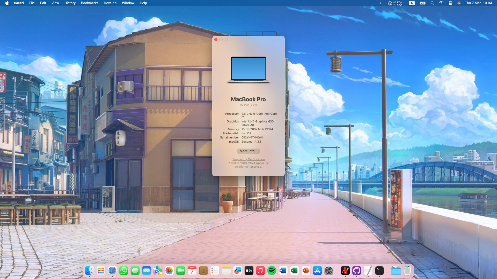

# Introduction
This is my personal documentation after successfully installing macOS Monterey and Ventura on my MSI GS65 Stealth 9SD and use it as daily driver.

# Machine information
|Parts|Details
|:---:|:---:|
Model | MSI GS65 Stealth 9SD
CPU | Intel® Core™ i7-9750H Processor (2.60 GHz. up to 4.50 GHz. 12M Cache)
Intel Generation | Coffee Lake
RAM | 6GB (2x 8GB) DDR4
iGPU | Intel CoffeeLake-S GT2 [UHD Graphics 630]
dGPU | NVIDIA GeForce GTX1660Ti 6GB (disabled as not supported by macOS)
Display | 15.6-inch FHD (1920×1080), 144Hz 100%sRGB
Wifi | Killer AC Wi-Fi
Bluetooth | Intel
Audio | Realtek ALC1220
SSD0 | ADATA XPG 512GB (purchased additionally, macOS installation and bootloader)
SSD1 | TOSHIBA 512GB (default from MSI, Windows 11 installation and bootloader)

# macOS information

# Bootloader information
OpenCore: 0.9.1

# What's Working
* Display functions (Color, Brightness, etc)
* Wifi
* Bluetooth
* Trackpad (multitouch and gesture support)
* Keyboard
* USB
* Webcam
* Audio
* Mic
* Sleep/Wake

# Notes
* I highly recommend building your own files by following Dortania's excellent guide. it will help you understand the big picture and how to use my files correctly. After you went through all the guide, you can use my files as an reference. 
* You need to generate your own SMBIOS, see Dortania's Guide. I spoof my device as MacBookPro16,4.
* If it somehow failes to boot with all my files, the problem is likely to be the DSDT.aml. DSDT is known to be unique to each devices. You will have to make your own DSDT and fix it with patches. I use SSDTTine by CorpNewt to create SSDT on Windows.
* I haven't tried USB Type-C and Thunderbolt port yet. I'll try later when I have them on my hand.

# Credits
- [Dortania](https://dortania.github.io/OpenCore-Install-Guide) for amazing work in providing comprehensive guides
- [Acidanthera](https://github.com/acidanthera) for kext
- [CorpNewt](https://github.com/corpnewt)
- [RehabMan](https://github.com/RehabMan)
- [Olarila](https://www.olarila.com/) got my first bootable EFI here

and many others that I have forgotten to include, sorry.
